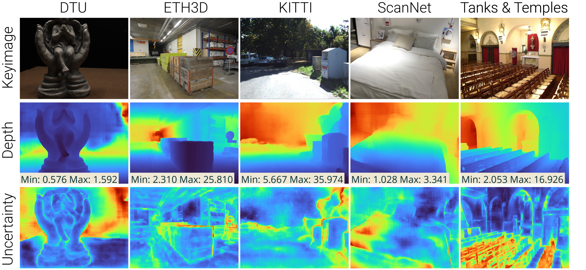

# Robust Multi-view Depth
[**Paper**](http://arxiv.org/abs/2209.06681)

**Robust** **M**ulti-**v**iew **D**epth (`robustmvd`) is a benchmark and framework for depth estimation 
from multiple input views with a focus on robust application independent of the target data. 
This repository contains evaluation code for the Robust Multi-view Depth Benchmark. 
Further, it contains implementations and weights of recent models together with inference scripts.



In the following, we first describe the setup, structure, and usage of the `rmvd` framework. 
Following this, we describe the usage of the Robust Multi-view Depth Benchmark. 

## The `rmvd` framework

### Setup

The code was tested with python 3.8 and PyTorch 1.9 on Ubuntu 20.04. 
For the setup, either the `requirements.txt` or the `setup.py` can be used.

To install the requirements, run:
```bash
pip install -r requirements.txt
```

To install the package using the `setup.py`, run:
```bash
python setup.py install
```
The package can then be imported via `import rmvd`.

To use the dataloaders from `rmvd`, datasets need to be downloaded and some need to be preprocessed before 
they can be used. For details, see [rmvd/data/README.md](rmvd/data/README.md).

### Structure

The `rmvd` framework contains dataloaders, models, evaluation/inference scripts for multi-view depth 
estimation. 

The setup and interface of the dataloaders is explained in [rmvd/data/README.md](rmvd/data/README.md).

The setup and interface of the models is explained in [rmvd/models/README.md](rmvd/models/README.md).

### Evaluation script
Evaluation is done with the script `eval.py`, for example on ETH3D:
```bash
python eval.py --model robust_mvd --dataset eth3d --eval_type mvd --inputs poses intrinsics --output /tmp/eval_output --input_size 768 1152 
```
On KITTI:
```bash
python eval.py --model robust_mvd --dataset kitti --eval_type mvd --inputs poses intrinsics --output /tmp/eval_output --input_size 384 1280
```
On DTU:
```bash
python eval.py --model robust_mvd --dataset dtu --eval_type mvd --inputs poses intrinsics --output /tmp/eval_output --input_size 896 1216
```
On ScanNet:
```bash
python eval.py --model robust_mvd --dataset scannet --eval_type mvd --inputs poses intrinsics --output /tmp/eval_output --input_size 448 640
```
On Tanks and Temples:
```bash
python eval.py --model robust_mvd --dataset tanks_and_temples --eval_type mvd --inputs poses intrinsics --output /tmp/eval_output --input_size 704 1280
```

The parameters `model`, `dataset` and `eval_type` are required. 

For further parameters, execute `python eval.py --help`.

### Programmatic evaluation

It is also possible to run the evaluation from python code, for example with:
```python
import rmvd
model = rmvd.create_model("robust_mvd", num_gpus=1)  # call with num_gpus=0 for CPU usage
eval = rmvd.create_evaluation(evaluation_type="mvd", out_dir="/tmp/eval_output", inputs=["intrinsics", "poses"])
dataset = rmvd.create_dataset("kitti", "mvd", input_size=(384, 1280))
results = eval(dataset=dataset, model=model)
```

For further details (e.g. additional function parameters, overview of available models, evaluations and datasets, ..),
see the READMEs mentioned above.

### Inference script
Evaluation is done with the script `inference.py`, for example:
```bash
python inference.py --model robust_mvd
```

### Programmatic inference
Inference with `rmvd` models can be done programmatically, e.g.:
```python
import rmvd
model = rmvd.create_model("robust_mvd")
dataset = rmvd.create_dataset("eth3d", "mvd", input_size=(384, 576))
sample = dataset[0]
pred, aux = model.run(**sample)
```

### Conventions and design decisions
Within this package, we use the following conventions:
- all data is in float32 format
- all data on an image grid uses CHW format (e.g. images are 3HW, depth maps 1HW); batches use NCHW format (e.g. images
  are N3HW, depth maps N1HW)
- models output predictions potentially at a downscaled resolution
- resolutions are indicated as (height, width) everywhere
- if the depth range of a scene is unknown, we consider a default depth range of (0.1m, 100m)
- all evaluations use numpy arrays as input and outputs
- all evaluations use a batch size of 1 for consistent runtime measurements
- GT depth values / inverse depth values of <=0 indicate invalid values
- predicted depth / inverse depth values of ==0 indicate invalid values

## Robust Multi-view Depth Benchmark

The Robust Multi-view Depth Benchmark (Robust MVD) aims to evaluate robust multi-view depth estimation on arbitrary 
real-world data. As proxy for this, it uses test sets based on multiple diverse, existing datasets and evaluates in 
a zero-shot fashion.

It supports multiple different input modalities:
- images
- intrinsics
- ground truth poses
- ground truth depth range (minimum and maximum values of the ground truth depth map)

It optionally supports alignment of predicted and ground truth depth maps to account for scale-ambiguity of some models.

Depth and uncertainty estimation performance is measured with the following metrics:
- Absolute relative error (rel)
- Inliers with a threshold of 1.03
- Sparsification Error Curves
- Area Under Sparsification Error (AUSE)

The following describes how to evaluate on the benchmark.

### Evaluation of models within the `rmvd` framework
Evaluation on the benchmark is done with the script `eval.py`, e.g.:
```bash
python eval.py --model robust_mvd --eval_type robustmvd --inputs poses intrinsics --output /tmp/eval_benchmark --eth3d_size 768 1152 --kitti_size 384 1280 --dtu_size 896 1216 --scannet_size 448 640 --tanks_and_temples_size 704 1280
```

The script `eval_all.sh` allows evaluation of all models in the `rmvd` framework on the benchmark:
```bash
./eval_all.sh -o /tmp/eval_benchmark
```

### Programmatic evaluation

It is also possible to run evaluation on the benchmark from python code, for example with:
```python
import rmvd
model = rmvd.create_model("robust_mvd", num_gpus=1)  # call with num_gpus=0 for CPU usage
eval = rmvd.create_evaluation(evaluation_type="robustmvd", out_dir="/tmp/eval_benchmark", inputs=["intrinsics", "poses"])
results = eval(model=model, eth3d_size=(768, 1152), kitti_size=(384, 1280), dtu_size=(896, 1216), scannet_size=(448, 640), tanks_and_temples_size=(704, 1280))
```

### Evaluation of custom models

With the programmatic evaluation described above, it is possible to evaluate custom models on the Robust MVD Benchmark.

The only constraint is that the custom model that is passed to `eval(model=model, ..)` needs to have the following 
functions:
- a `input_adapter` function
- a `__call__` function (in `torch` basically equivalent to the `forward` function) 
- a `output_adapter` function

These functions are basically used to convert data between the formats of the `rmvd` framework and the model-specific
format and to call the model. For details about these functions, see [rmvd/models/README.md](rmvd/models/README.md).

## TODOs
- [ ] add models that were evaluated in the publication to the `rmvd` framework
- [ ] add code to gather and visualize benchmark results
- [ ] add project page including an overview of the benchmark and a leaderboard
- [ ] improve Tanks and Temples GT Depth
- [ ] add code to train the models
- [ ] add code to run inference directly from COLMAP or Meshroom outputs

## Changelog
### Sept 13 2022 First version

## Citation
This is the official repository for the publication:
> **[A Benchmark and a Baseline for Robust Multi-view Depth Estimation](http://arxiv.org/abs/2209.06681)**
>
> [Philipp Schröppel](https://lmb.informatik.uni-freiburg.de/people/schroepp), [Jan Bechtold](https://lmb.informatik.uni-freiburg.de/people/bechtolj), [Artemij Amiranashvili](https://lmb.informatik.uni-freiburg.de/people/amiranas), [Thomas Brox](https://lmb.informatik.uni-freiburg.de/people/brox)
> 
> **3DV 2022**

If you find our work useful, please consider citing:
```bibtex
@inproceedings{schroeppel2022robust,
  author     = {Philipp Schr\"oppel and Jan Bechtold and Artemij Amiranashvili and Thomas Brox},
  booktitle  = {Proceedings of the International Conference on {3D} Vision ({3DV})},
  title      = {A Benchmark and a Baseline for Robust Multi-view Depth Estimation},
  year       = {2022}
}
```
