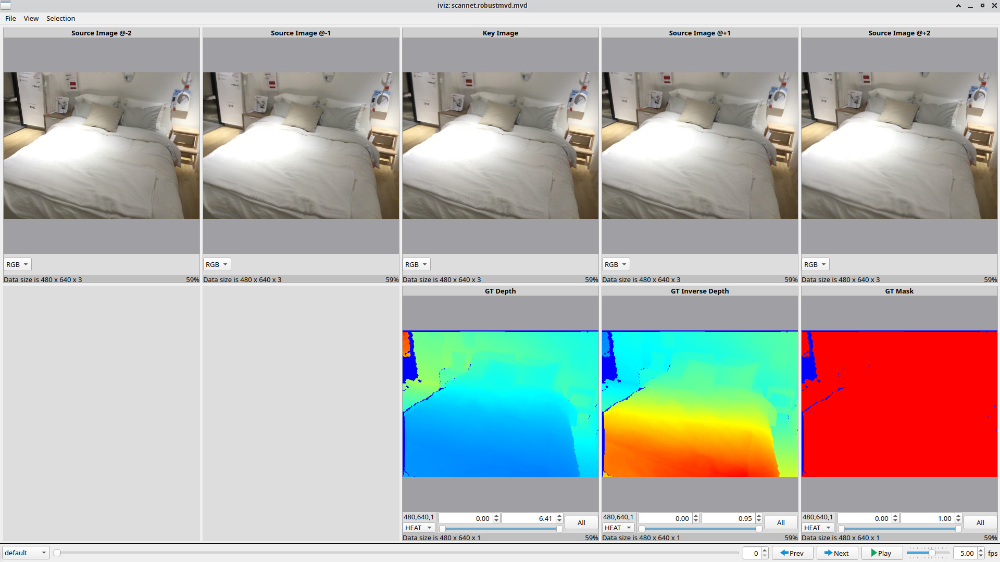

# Data viewer

The data viewer can be used to visualize datasets and evaluation results. 

It is based on the [iViz](https://github.com/eddy-ilg/iviz) project by [Eddy Ilg](https://github.com/eddy-ilg).



Features of the data viewer:
- visualize images and color-coded depth maps
- control the range of the color-coding
- click individual pixels to inspect pixel values (use `CTRL` to select pixels in all images simultaneously)
- zoom in by pressing `SHIFT` and hovering over an image (use `CTRL+SHIFT` to zoom in all images simultaneously)
- select an area by clicking and dragging (use `CTRL` to select areas in all images simultaneously)
- choose between different layouts; each layout shows a different view on the data

---

## Usage
### Viewing a Dataset
#### From the command line
The script `data-viewer.py` in the root directory of the `robustmvd` repository can be used to view a dataset, for
example ScanNet:
```bash
./data-viewer.py scannet.robustmvd.mvd  # optional: --layout layout_name, e.g. --layout all_images
```

For further details, execute `./data-viewer.py --help`.

#### From python code
The data viewer can also be used from python code as follows:
```python
from rmvd import create_dataset, run_viewer
dataset = create_dataset("scannet.robustmvd.mvd")
run_viewer(dataset)  # optional layout=layout_name, e.g. run_viewer(dataset, layout="all_images")
```

---

## Implementation
The data viewer is structured as a grid where each grid cell displays certain data.

The arrangement of grid cells, as well as functions to load the data to be displayed, is defined by so-called layouts.

Each dataset is associated with a list of layouts. The user can select a layout from the list of layouts.

### MVC design pattern
The data viewer is structured according to a MVC design pattern:
- `ViewerModel` class: Holds the dataset; supplies the layout and the data to the viewer.
- `Viewer` class: Displays the data according to the currently selected layout.
- `ViewerControls` class: Controls the viewer, i.e. allows the user to select a layout and iterate over samples in 
the dataset.
